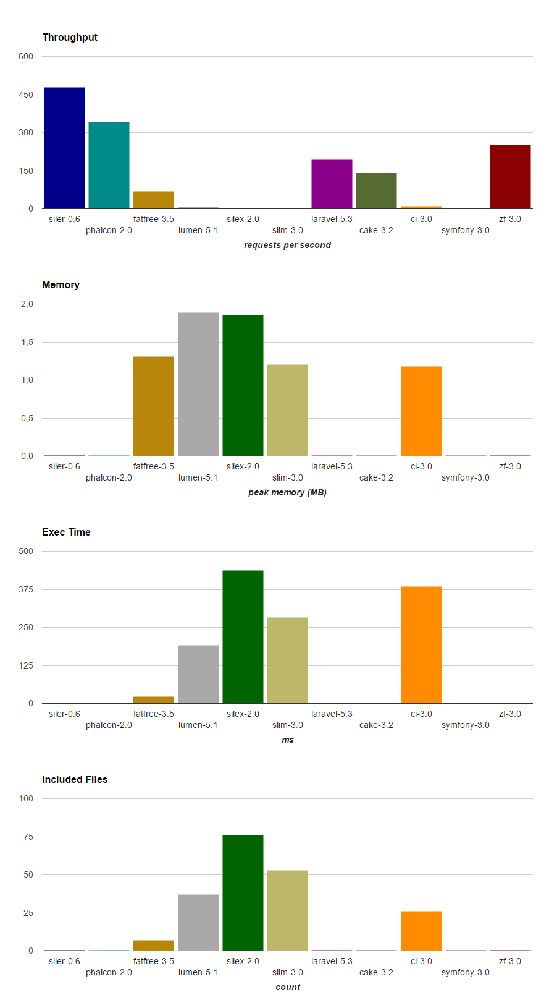

# Siler
PHP files and functions as first-class citizens.

[](https://travis-ci.org/leocavalcante/siler)
[](https://codecov.io/gh/leocavalcante/siler)
[](https://scrutinizer-ci.com/g/leocavalcante/siler/?branch=master)
[](https://github.com/phpstan/phpstan)
[](//packagist.org/packages/leocavalcante/siler)
[](https://packagist.org/packages/leocavalcante/siler)
[](https://insight.sensiolabs.com/projects/703f233e-0738-4bf3-9d47-09d3c6de19b0)

Zero dependecy. Everything should be built on top of PHP's built-in functions and helpers around vendors are totally optional.

###### index.php
```php
<?php
require_once __DIR__.'/../vendor/autoload.php';
use Siler\Route;
Route\get('/', 'pages/home.php');
```
###### pages/home.php
```php
<?php echo 'Hello World';
```
---
Since it's plain old PHP files and functions, no surprises it's **blazing fast!**

*Benchmark powered by: [github.com/kenjis/php-framework-benchmark](https://github.com/kenjis/php-framework-benchmark) [Official results](https://github.com/kenjis/php-framework-benchmark/pull/74#issuecomment-279357554)

[Project example](https://github.com/leocavalcante/siler-example)
